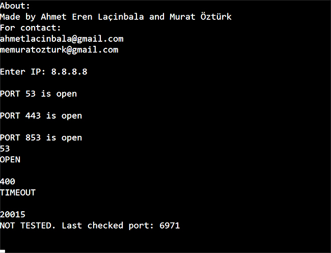

[*Türkçe aşağıda*]


# Description:


This tool can be used to scan and check the ports of a host.
We wrote this project in C++ with the network module of SFML library. 
It’s a fast and effective tool to scan all the ports of a network.
 
# Requirements:
In order to use this program, the SFML library must be installed. To compile this project, sfml-network, sfml-system and for linux pthreads must be linked to the compiler.
Compiling for linux :

```g++ port_scanner_sfml.cpp -o app  -lsfml-system -lsfml-network -lpthread```

 
:warning: **Warning**: In case of an internet connection loss while using this tool, reduce the “num_threads” integer by half.
 
# How It Works?
Firstly, the user enters the IP that’s going to be scanned.
In order for the program to run faster, a total number of 64 threads have been created. Number of threads can be changed manually from the source code. Threads start to scan the ports in parallel. After a thread finishes the scanning, the thread sums the port that it scanned and number of threads which is 64 for now. Thus thread finds the next port number it’s going to scan. Then the thread calls itself with the new port it’s going to scan. For example, the third thread scanned the port 3. Sum of 3 and 64 is 67. The next port that the third thread is going to scan is 67. In order to not block a thread, threads will scan a port for 300ms. If there is no response after 300ms, the port is marked as “Timeout”. Thread pool can be used more effectively and it is more memory friendly with this method.
Then the thread scans the next port it is going to scan.
Open ports are printed to the terminal. the status of a specific port can be checked by writing the port number to the terminal while scanning is going on.
 

# Açıklama:
Bu program, bir ana bilgisayarın portlarını taramak ve kontrol etmek için kullanılır.
Bu programı yazarken C++ SFML kütüphanesinin network modülünü kullandık.
Tüm portları hızlı ve etkili bir şekilde tarayabilirsiniz.

# Gereklilikler:
Bu programı kullanabilmek için SFML kütüphanesinin kurulu olması gerekmektedir. Bu projeyi derlemek için sfml-network, sfml-system ve linux pthreads derleyiciye linklenmelidir.
Linux üzerinde derlemek için:
 g++ port_scanner_sfml.cpp -o app  -lsfml-system -lsfml-network -lpthread

:warning: **Uyarı**: Bu aracı kullanırken internet bağlantısının kesilmesi durumunda “num_threads” sayısını yarı yarıya azaltın.

# Çalışma Mantığı:
Programın daha hızlı çalışabilmesi için 64 adet thread oluşturulmuştur.
Threadler paralel olarak portları taramaya başlar. 
Bir thread tarama işini bitirdikten sonra  thread, kontrol ettiği port sayısı thread sayısı sayısına ekleyerek kontrol edeceği bir sonraki portu bulur ve kendi fonksiyonunu tekrar çağırarak işleme devam eder. Örnek olarak 3. thread taramayı bitirdiğinde, 3 ve 64’ün toplamı 67’dir, bir sonraki kontrol edeceği port numarası 67 olur. Eğer bir porttan 300ms boyunca cevap gelmezse “Timeout” olarak kabul edilir.  Böylece aynı thread havuzu etkili şekilde kullanılabilmiş olur. Tarama işlemi devam ederken açık olan portlar ekranda gösterilir. Eğer istenilen bir portun durumu kontrol edilecekse o portun numarası ekrana yazılır. Program portun durumunu ekranda gösterir. 

Derlemek için (Linux):

```g++ port_scanner_sfml.cpp -o app  -lsfml-system -lsfml-network -lpthread```

Derledikten sonra app isimli dosyayı göreceğiz. 
```./app``` ile çalıştırıp ip adresi giriyoruz.

 


